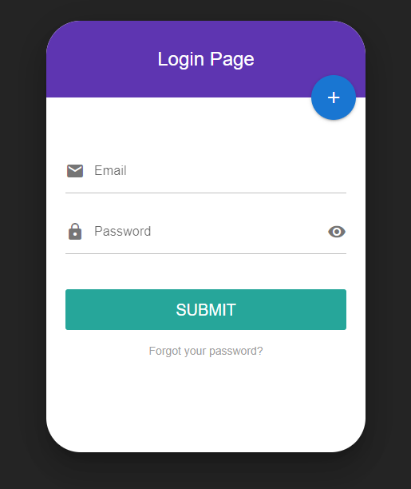
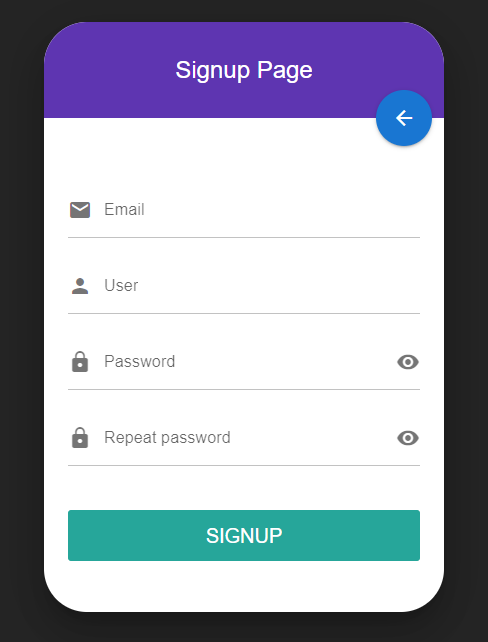
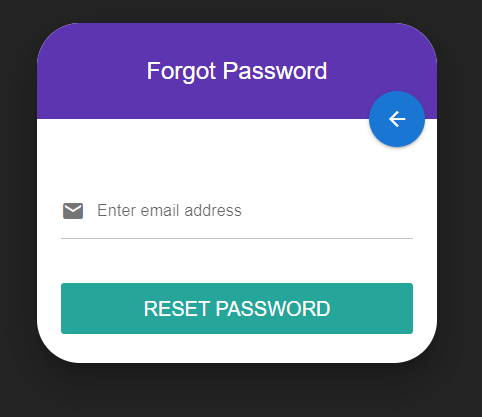
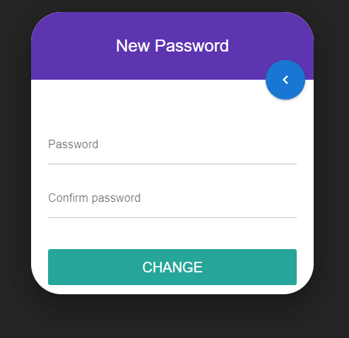
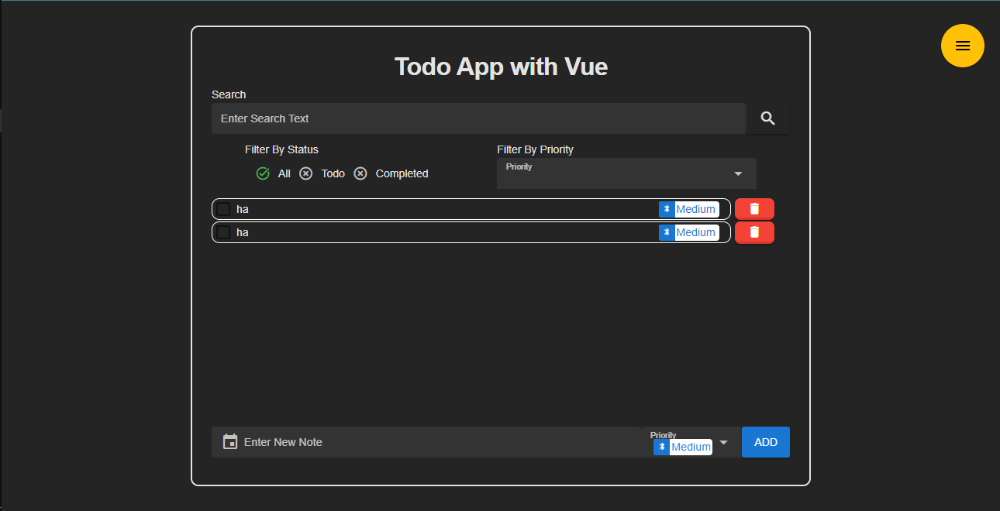

# Vue 3 + Vite

This template should help get you started developing with Vue 3 in Vite. The template uses Vue 3 `<script setup>` SFCs, check out the [script setup docs](https://v3.vuejs.org/api/sfc-script-setup.html#sfc-script-setup) to learn more.

# **Feature**

- ***Note***: 
  - **Create Note:** Note contain properties: Content + Priority.
  - **Toggle Note:** Toggle Note to set note is completed or must to do(if note is completed then have (opacity-0.5 + line through effect)).
  - **Delete Note:** Delete Note.
  
- ***Filter***: 
  - **Search Name Note:** Find find the notes that contain ***the searched character.*** 
  - **Filter By Status:** Find find the notes by Status: ***Completed & Todo.***
  - **Filter By Priority:** Find find the notes by Priority: There have 3 items: ***Low - Medium - High.***
  
- ***Page***: 
  - **Login:** `Use require Function check not be empty any field`
    - Email field: 
      - Must have email format: xxx@mail.com
    - Password field:       
      - Must have contain least ***1 uppercase, 1 special, and 1 lowercase character.***
      - More than 6 characters
    - Switch Button: switch Login <=> SignUp
    - Forgot Password: navigate ***Forgot Password Page***
  
  

  - **Sign Up:** `Use require Function check not be empty any field`
    - Email field: 
      - Must have email format: xxx@mail.com
    - User Field: Name of User.
    - Password field:       
      - Must have contain least ***1 uppercase, 1 special, and 1 lowercase character.***
      - More than 6 characters.
    - Repeat Password: 
      - Check the match between Password & Repeat Password.
    

  - **Forgot Password:** Layout.
  

  - **New Password:** Layout.

  

  - **Main ListNote:** Contain 3 Component: **Filter** + **AddNote** + **ListNote**

  

  
